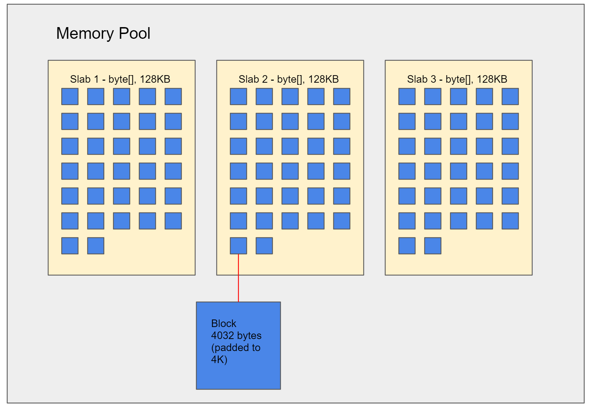

# Pipelines Part 1 - High Level Overview, and Memory Pools

**NEEDS WORK** - this text was migrated from a proposed blog article and needs restructuring to be suitable as a docs item, and updating to the current API

---

"Pipelines" is the eagerly anticipated IO stack working it's way through [corefxlab](https://github.com/dotnet/corefxlab); it is what was once called "channels", which I [wrote about previously](http://blog.marcgravell.com/2016/09/channelling-my-inner-geek.html). I'm going to take a few blog posts to walk through what this stack *means*, why you might want to use it, and *how* to use it.

## Disclaimer : I'm not on the inside here

Don't take anything here as set in stone, and it is entirely possible that I've misunderstood some things, or have missed subtle nuance and context. My "role" in the pipelines work, if that is even the right word, is: interested API consumer and occasional contributor.

## A foreword

A lot of the concepts discussed in this serious are going to be pretty "deep". They're going to be low-level (for C#, at least), and discussing issues that *most C# developers never face*, because some other C# developers have encapsulated it for them.

**DO NOT PANIC** if you see something in here and think "what the hell is that?". It doesn't mean you are missing something - you're doing just fine. Just: there are a set of tools that are commonly needed for certain jobs, and you haven't had to do those jobs yet. If you've never written a TCP socket server that handles a protocol at the wire level, or a custom serializer, or an encryption or compression library - then you probably won't have needed these things and they will look unfamiliar.

You might even look at the code here and think "woah, that's quite a bit of work to do something simple". But: if you *are* one of the people who've had to do those things, I can pretty much guarantee that you'll be nodding along thinking things like "oh, I understand what that's doing", "yeah, I've done something just like that", and "oh, I see how that is saving me a pile of mess and making my life simpler". And probably "Marc, stop going off on asides, it is distracting".

If it helps, I am *utterly useless* at CSS. Embarrassingly, unbelievably bad. 

## Ultra high level: what problems do 'pipelines' solve?

Entire new frameworks don't usually get written just for fun, and this is no exception. There are a range of recurring problems in IO related systems that pipelines attempts to address in a generic way that is reusable by a wide range of systems. Some of the things it does is simply providing a reusable code base so that each consuming library doesn't need to implement it itself, but some of the things it provides are pretty radically new - requiring language enhancements and benefitting from new JIT features to optimize these specific patterns. Most of the recently released and upcoming C# language improvements relating to any combination of the `ref`, `struct`, `in` and `readonly` keywords have been driven in a large part by the requirements needed to make "pipelines" a step-change above anything that has been possible before. And ultimately, most of those things are about performance and scalability:

- performance: provide performance-critical abstractions for describing chunks of memory suitable for low-level code such as network, protocol, and serialization libraries
- performance: avoid copying blocks of memory by using a "zero copy" approach whenever possible
- scalability: do the above with minimal allocations for most likely workloads of those low-level libraries, to avoid gen-0 collections (which are still expensive when done in large quantities)
- scalability: provide a memory-pool concept that IO libraries can make use of to efficiently lease memory
- scalability: do the above in a way that works well massively concurrent server applications where many connections might be inactive or have partially-complete frames
- scalability: provide an efficient "back buffer" implementation (i.e. input data that isn't yet complete enough to be fully processed) - without needing to repeatedly copy the *unprocessed* bits down to the start of a receive buffer
- scalability: if it turns out that we need more space that we initially expected, trivially lease extra space without needing to allocate and copy over the incomplete data
- scalability: and do everything mentioned above in a way that works well for both synchronous and asynchronous scenarios

These are complex and lofty goals, and it makes absolute sense to solve them once in a reusable way, rather than every low-level library having to solve it separately.

## Many developers will be silent benefactors of this work

The kind of low-level code that pipelines targets is - let's be fair: niche. But lots and lots of code *makes use of* that low-level code. The most obvious examples would be things like the "Kestrel" web-server and various serialization libraries making use of pipelines, leading to pipe-dream (badum-tish) release notes like:

- v5.2.0
  - internal change: switch to pipelines-based implementation
  - API change: new constructor overload on `FooServer` to take optional external memory-pool
  - API change: new overloads to accept pipe inputs/outputs
  - impact: improved speed, lower memory usage, reduced allocations, smaller library size

(the smaller library size here being by removing the library-specific implementations of some of the things that pipelines now offers, and yes - this release note is probably a *little* on the exaggerated positive side)

The point here is: you don't need to be writing direct socket-based servers of obscure protocols to benefit from pipelines. And many of the concepts and changes introduced *to facilitate* pipelines could still bring huge additional benefits by themselves.

# Drowning in a sea of memories; the `MemoryPool`

The first thing we want to do when dealing with IO is to avoid constantly allocating and resizing buffers. So that's where the `MemoryPool` comes in. Strictly speaking, pipelines should work with any implementation of the `MemoryPool<byte>` abstract base type, but for most practical scenarios we will be talking about the concrete `MemoryPool` in the pipelines code, which uses a "slabs and blocks" approach:



The `MemoryPool` type acts as a wrapper for a number of *slabs*, where each slab is a 128KB `byte[]` logically partitioned in 32 *blocks*. When a consumer asks for some memory, they are handed an available block, and that block is now unavailable. Each block is just under 4KB in size. If the consumer still needs more, they will be given another block, which could be *from anywhere* - even in another slab. It might sound like this would be limiting: a consumer can't say "I need 42KB of contiguous memory" - but in reality this isn't an issue: they can make use of 11 separate blocks instead. As a side note: the "just under 4KB" here is an optimization to avoid automatic pre-fetch that happens on many CPUs when you read memory too close to a 4KB boundary; when using a block-based model, it is very unlikely that the next bytes read will *actually be* from that next block.

If there are no available blocks, then a new slab can can be allocated to create new blocks. Individual blocks can be returned independently, so it might happen that 5 blocks are leased, with 3 of them being returned almost immediately, and the other 2 retained for a short while.

Because pipelines code is typically going to touch on IO layers, the `byte[]` that define the slabs are *pinned* automatically - making it very easy to work with them with P/Invoke even to underlying OS APIs without having to worry about it moving around. Since the slabs are large enough to ensure that they are allocated on the Large Object Heap, having them pinned doesn't really impact heap compaction.

## The lifetime of a memory pool

We'll meet some concepts later like `Pipe` that expect you to passs *in* a memory pool. To create a memory pool is as simple as `new`-ing one up:

    var memoryPool = new MemoryPool();

Note that `MemoryPool<T>` is *disposable* (i.e. `: IDisposable`), but we will *not* usually use it with `using`, because a memory pool is not intended to be transient. Instead, it would be typical to store it as a field on some object that represents the lifetime of a particular system. The more you can share and re-use it: the better, within reason. You *should* remember to `Dispose()` the memory pool when you're genuinely done with it, though - quite likely in the `Dispose()` method of a wrapper object.

## What API does a memory pool expose?

Firstly, some emphasis: most *consumer* code won't ever deal with the `MemoryPool<byte>` directly. In our case, the 'pipelines' code is going to handle all those negotiations *for us*. But understanding the API gives us a handy introduction into some of the abstractions involved. We obtain a block via the `Rent()` method. This gives use an "owned memory", which we can `Release()` when we're done:

```
MemoryPool<byte> pool = null;
OwnedMemory<byte> block = pool.Rent();
block.Release(); // make it available again
```

`OwnedMemory<T>` is a concept for describing a block of memory *backed by explicit memory management*. Rather than being garbage collected, it uses reference counting with increment (`Retain()`) and decrement (`Release()`) methods. This has advantages and disadvantages in general code, but: it is a good fit here. Obviously if you write your own code that talks directly to the `MemoryPool<byte>`, you'll need to be very careful to ensure you get the increment/decrement code correct, or you can quickly get into trouble. But it enables some very interesting scenarios: the leased memory can now *outlive* the code that knows about the IO layer, without ever needing to materialize it into a separate object (like a `string` or a `byte[]` that describes the specific data). If we write some IO code that is going to *hand the data out* (to code that will run separately), it can call `Retain()` an extra time, and now it becomes *the consumer's* responsibility - we've essentially transferred ownership cleanly. Obviously the *consumer* now needs to remember to call `Release()` when it is done with the data, or the block will be leaked.

It might sound like this is prone to errors, but again: most of this flexibility is for advanced scenarios beyond what most people will need, or is features that is intended to be used by existing framework code like "pipelines". Heck, you can even create your own custom `MemoryPool<byte>` (perhaps using unmanaged memory) - but I expect few people ever will. You aren't compelled to use any of this - and I fully expect that for most people their *entire interaction* with the memory pool can be summarized by `new MemoryPool()` and `.Dispose()`. So: don't panic!

## Summary

So far, we've looked at *why* 'pipelines' exists, and to start investigating how to use them, we've had a look at the memory pool idea that pipelines depends on. Next time, we'll start looking at "pipes" - our mechanism for getting data in and out of a system.